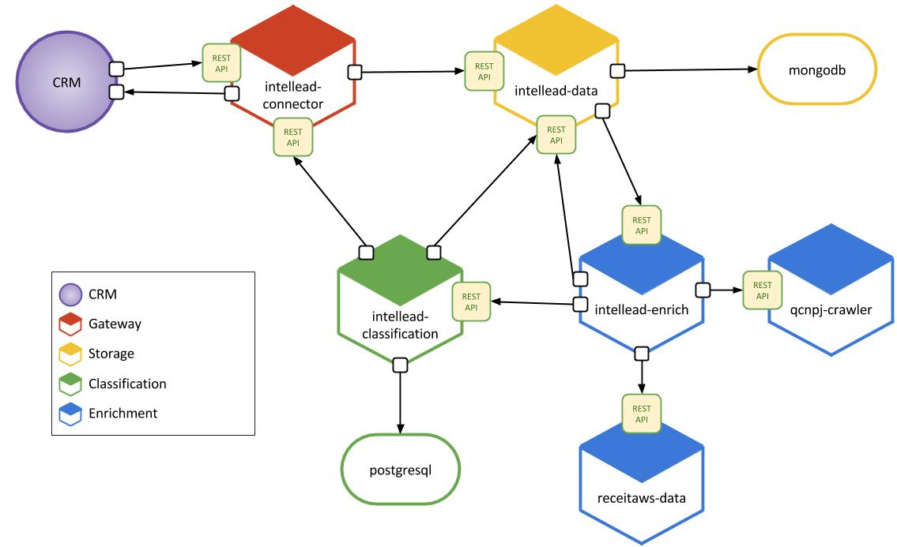

# Build intellead and deploy it to Docker



intellead microservices architecture

### Microservices

- [intellead-connector](https://github.com/intellead/intellead-connector)
- [intellead-security](https://github.com/intellead/intellead-security)
- [intellead-data](https://github.com/intellead/intellead-data)
- [intellead-enrich](https://github.com/intellead/intellead-enrich)
- [receitaws-data](https://github.com/intellead/receitaws-data)
- [qcnpj-crawler](https://github.com/intellead/qcnpj-crawler)
- [intellead-classification](https://github.com/intellead/intellead-clasification)

### Microservices

- [intellead-integration-tests](https://github.com/intellead/intellead-integration-tests)

### How to run intellead

We need to have docker installed previously.

```
$ bash < setup.sh
```

This will basically clone every intellead repository in ./bin/ folder.

```
$ bash < cd bin
$ bash < docker-compose up --build
```

Then we call docker-compose and it starts all intellead microservices.
