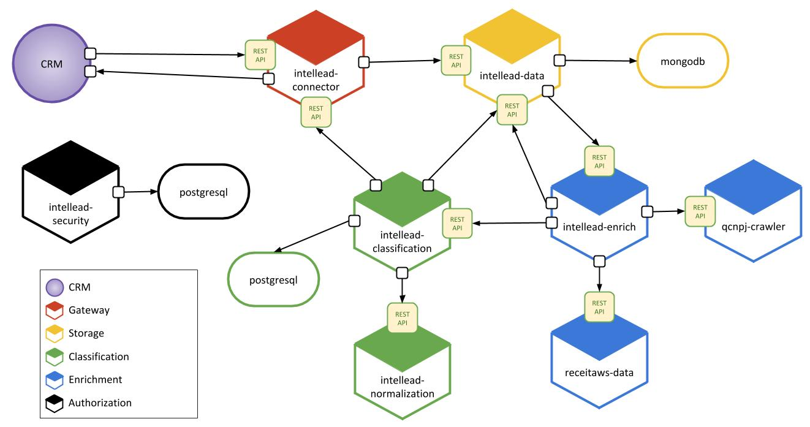

# Build intellead and deploy it to Docker



intellead microservices architecture

## Documentation

### Microservices

- [intellead-connector](https://github.com/intellead/intellead-connector)
- [intellead-security](https://github.com/intellead/intellead-security)
- [intellead-data](https://github.com/intellead/intellead-data)
- [intellead-enrich](https://github.com/intellead/intellead-enrich)
- [receitaws-data](https://github.com/intellead/receitaws-data)
- [qcnpj-crawler](https://github.com/intellead/qcnpj-crawler)
- [intellead-classification](https://github.com/intellead/intellead-classification)
- [intellead-normalization](https://github.com/intellead/intellead-normalization)

### Integration Tests

- [intellead-integration-tests](https://github.com/intellead/intellead-integration-tests)

### How to run intellead

We need to have git and docker installed previously.

```
$ bash < git clone https://github.com/intellead/intellead-getting-started.git
$ bash < cd intellead-getting-started
```

Now we need to run the script that will get all intellead sources.

```
(unix)      $ bash < setup.sh
(windows)   $ bash < setup.bat
```

This will basically clone every intellead repository in ./bin/ folder.

```
$ bash < cd bin
$ bash < docker-compose up --build
```

Then we call docker-compose and it starts all intellead microservices.

## Contributing

See the [CONTRIBUTING.md](./CONTRIBUTING.md) document for details.
